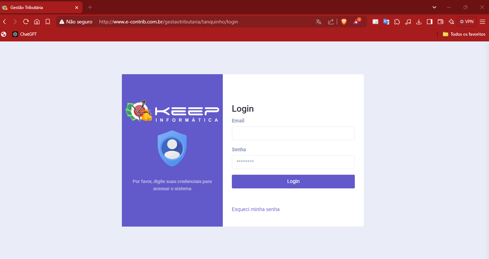

#   ✅ Estrutura da URL:
####  🌐 Base da URL:
    www.e-contrib.com.br
*   **Caminho (rota principal):** /gestaotributaria
*   **Parâmetro dinâmico:** [entidade] ⇒  uma string (nome VARCHA(50)) da tabela entidades.
*   **Rota final:** /login

####    Nome da entidade seja "keep” a URL final seria:
     www.e-contrib.com.br/gestaotributaria/keep/login

###  Descrição:
*   A URL é composta pela base (www.e-contrib.com.br) seguida pela rota fixa /gestaotributaria, indicando que estamos acessando o módulo de gestão tributária;
*   Em seguida, o parâmetro **[entidade]** (como "keep”) é passado dinamicamente para identificar a entidade no sistema;
*   Por fim, a rota termina com /login, indicando a ação que está sendo realizada;

# Tabela de Contribuinte 

 **\#**  | **Campo**                   | **Tabela Raiz**         | **Tipo/Tamanho**        | **Descrição**                                                                        |
---------|-----------------------------|-------------------------|-------------------------|--------------------------------------------------------------------------------------|
 1       | ID                          |                         | BIGINT \(20\) UN AI PK  | Identificador cadastro do contribuinte\.                                             |     
 2       | fk\_pais                    | pais                    | BIGINT \(20\) UN        |                                                                                      |      
 3       | fk\_cidade                  | cidade                  | BIGINT\(20\) UN         |                                                                                      |    
 4       | fk\_tipo\_logradouro        | tipo\_logradouro        | BIGINT\(20\) UN         |                                                                                      |      
 5       | fk\_bairro                  | bairro                  | BIGINT\(20\) UN         |                                                                                      |     
 6       | fk\_imovel\_caracteristica  | imovel\_caracteristica  | BIGINT\(20\) UN         | Cadastro da entidade => empresa                                                      |  
 7       | razao\_social               |                         | VARCHAR\(100\)          |                                                                                      |    
 8       | fantasia                    |                         | VARCHAR\(100\)          | ADD + Campo caso "tipo" == 1 (Tipo => Juridico)                                      |      
 9       | cpf\_cnpj                   |                         | VARCHAR\(100\)          | Observação: Preencher com CPF/CNPJ válido.                                           |      
 10      | email                       |                         | VARCHAR\(100\)          | Endereço eletrônico.  **Validação:** e-mail deve ser possuir o caractere "@"   e este não pode estar no início e no fim do e-mail. Deve possuir no mínimo   um caractere "." depois do @ e não pode estar no início ou no final do e-mail.                                                       |      
 11      | unidade                     |                         | VARCHAR\(20\)           |                                                                          |      
 12      | contato                     |                         | VARCHAR\(20\)           | Número de telefone do contribuinte, com DDD.   **Validação:** Se preenchido, deve conter apenas números, com o mínimo de dez dígitos.| 
 13      | contato2                    |                         | VARCHAR\(20\)           | Número de telefone do contribuinte, com DDD.   **Validação:** Se preenchido, deve conter apenas números, com o mínimo de dez dígitos.|      
 14      | contato\_wpp                |                         | VARCHAR\(20\)           | **Validação:**   0 - não é whats app;   1 - Sim é Whats app; |     
 15      | tipo                        |                         | TINYINT\(4\)            | Tipo Juridico ou Fisico.  **Valores:** 0 - Fisico   1 - Juridico|     
 16      | CEP                         |                         | VARCHAR\(9\)            | Código de Endereçamento Postal - CEP.   **Validação:** Deve ser preenchido apenas com números, com 8 (oito) posições.|      
 17      | endereco                    |                         | VARCHAR\(100\)          | Endereço do contribuinte|      
 18      | numero                      |                         | VARCHAR\(100\)          | Número do logradouro.  Se não houver número a ser informado, preencher com "S/N".|   
 19      | complemento                 |                         | VARCHAR\(200\)          | Complemento do logradouro.            |
 20      | site                        |                         | VARCHAR\(255\)          |                                       |
 21      | imagem                      |                         | VARCHAR(191)            | Apenas Arquivos imagem. |
 22      | situação                    |                         | TINYINT(4) NN           | **Valores válidos:**  SITUACAO_INATIVO = 0;   SITUACAO_ATIVO = 1;  SITUACAO_OBITO = 2;   **Regras:**   - Registro de falecimento;|
 23      | observacoes                 |                         | Text                    | **Default/Expression:** Null |
 24      | prefeito_nome               |                         | VARCHAR(100)            |  Campo referente cadastro "entidade" => "empresa";|
 25      | prefeito_ass_digitalizada   |                         | VARCHAR(100)            |  Campo referente cadastro "entidade" => "empresa";|
 26      | chefe_setor_nome            |                         | VARCHAR(100)            |  Campo referente cadastro "entidade" => "empresa";|
 27      | chefe_setor_cargo           |                         | VARCHAR(100)            |  Campo referente cadastro "entidade" => "empresa";|
 28      | chefe_setor_portaria        |                         | VARCHAR(30)             |  Campo referente cadastro "entidade" => "empresa";|
 29      | chefe_setor_ass_digitalizada|                         | TEXT                    |  Campo referente cadastro "entidade" => "empresa";|    
 30      | created_at                  |                         | TTIMESTAMP              |  Campo referente data de cadastro contribuinte;|  
 31      | update_at                   |                         | TIMESTAMP               |  Campo referente data da ultima atualização do contribuinte;|  